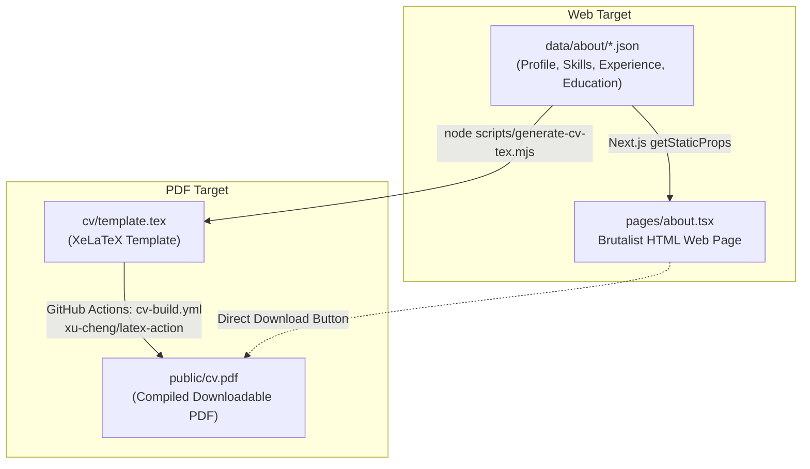

# Curriculum Vitae (CV) Pipeline & Architecture Decisions

This document details the architecture, rendering pipeline, attempted approaches, and limitations explored when integrating the LaTeX CV into the personal blog.

---

## 1. Overview & Directory Structure

- `data/about/*.json` — **Single Source of Truth** for all personal information, career experience, skills, and education.
- `scripts/generate-cv-tex.mjs` — Automated template engine generating clean, properly formatted LaTeX from `data/about/*.json`.
- `cv/template.tex` — Generated LaTeX resume source.
- `cv/twentysecondcv.cls` — Custom two-column LaTeX class file defining layout, margins, and typography (requires XeLaTeX).
- `cv/fonts/` & `cv/img/` — Supporting assets and fonts (`segoeuib.ttf`).
- `public/cv.pdf` — Compiled production PDF artifact for direct downloads.
- `pages/about.tsx` — Native brutalist React / Next.js web page consuming the exact same structured data.
- `.github/workflows/cv-build.yml` — Automated CI compilation workflow.

---

## 2. Final Architecture (Single-Source Dual Rendering)



### Why this architecture was chosen:
1. **Single Source of Truth**: Eliminates manual synchronization between the web portfolio and the downloadable CV.
2. **Maximum Typographic Fidelity**: Retains the precise geometry, sidebar, and fonts of `twentysecondcv.cls` via XeLaTeX without compromises.
3. **No Heavy Local Dependencies**: TeXLive compilation is offloaded to GitHub Actions; local Next.js builds remain fast and lightweight.

---

## 3. Approaches Attempted & Technical Limitations

### Approach A: Embedded PDF Viewer in Browser (`<object>` / `<iframe>` on `/cv`)
- **Attempted**: Created a dedicated `/cv` page embedding `public/cv.pdf` inside an HTML `<object>` / `<iframe>`.
- **Limitation & Failure Mode**:
  - Modern desktop browsers (e.g. latest Google Chrome) and mobile Safari frequently block or disable inline PDF embeds due to built-in PDF viewer sandboxing and Content Security Policies (CSP).
  - The fallback UI was shown instead of the document, creating a poor user experience.
- **Resolution**: Replaced the embedded PDF viewer route with a rich, native, accessible React experience on `/about`, featuring a prominent direct download button for `public/cv.pdf`.

---

### Approach B: Typst (`.typ`) Migration
- **Attempted**: Converted the resume to a modern [Typst](https://typst.app/) (`.typ`) markup file to achieve sub-second local compilation without TeXLive.
- **Limitation & Failure Mode**:
  - While Typst compiles rapidly, replicating the bespoke geometry, margin offsets, custom font bindings (`fontspec`), and timeline layout of `twentysecondcv.cls` led to visible layout differences and visual output regressions.
  - Porting broke direct two-way compatibility with existing LaTeX and Overleaf ecosystems.
- **Resolution**: Retained the original XeLaTeX template as the compiled artifact generator.

---

### Approach C: Overleaf Git Bridge Sync via CLI & 1Password
- **Attempted**: Created an `overleaf` CLI utility in `shared-utilities` that resolved Overleaf Git credentials from 1Password (`op://Dev/Overleaf Git Token`) to push and pull directly to `https://git.overleaf.com/PROJECT_ID`.
- **Limitation & Failure Mode**:
  - Overleaf restricts its Git bridge (`git.overleaf.com`) to paid premium subscription plans. Free-tier accounts return `fatal: remote error: no git access`.
  - Adding external sync tooling added unnecessary maintenance overhead when GitHub itself is already the central source control system.
- **Resolution**: Removed the external Git sync CLI. The repository under `blog/` is the single definitive source of truth. If Overleaf is needed in the future, project files can be imported directly from the `cv/` directory.

---

## 4. Maintenance & Operations

- **Updating Experience or Skills**: Edit files in `data/about/` (`experience.json`, `skills.json`, `profile.json`, `education.json`).
- **Regenerating LaTeX Template**:
  ```bash
  node scripts/generate-cv-tex.mjs
  ```
- **Local PDF Compilation (Optional if MacTeX/XeLaTeX is installed)**:
  ```bash
  cd cv && xelatex template.tex && cp template.pdf ../public/cv.pdf
  ```
- **CI/CD Deployment**: On `git push`, GitHub Actions automatically regenerates `template.tex`, compiles `public/cv.pdf`, and commits the updated PDF to the release branch.
